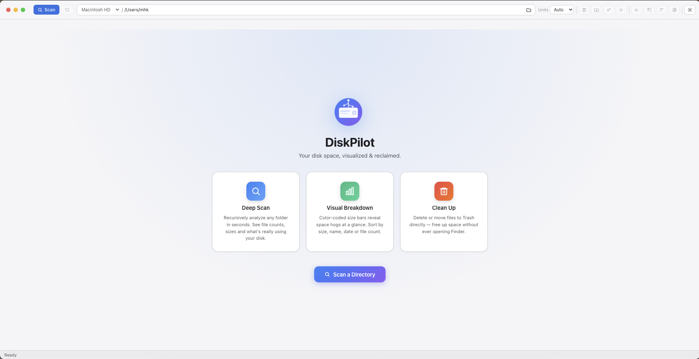
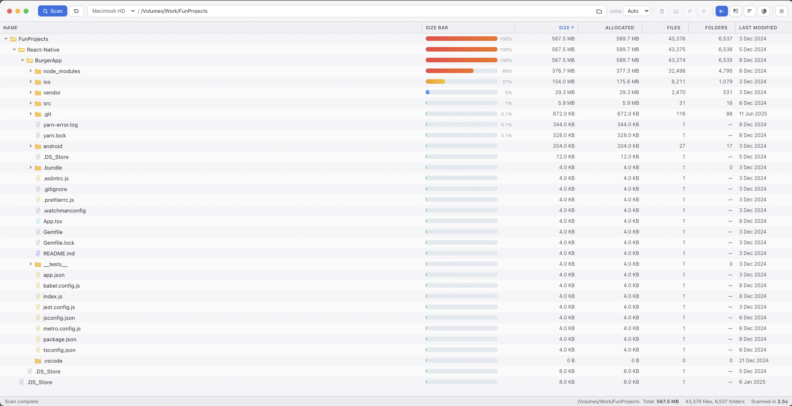
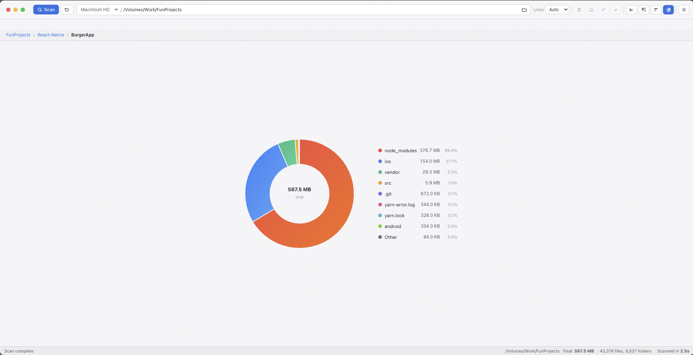
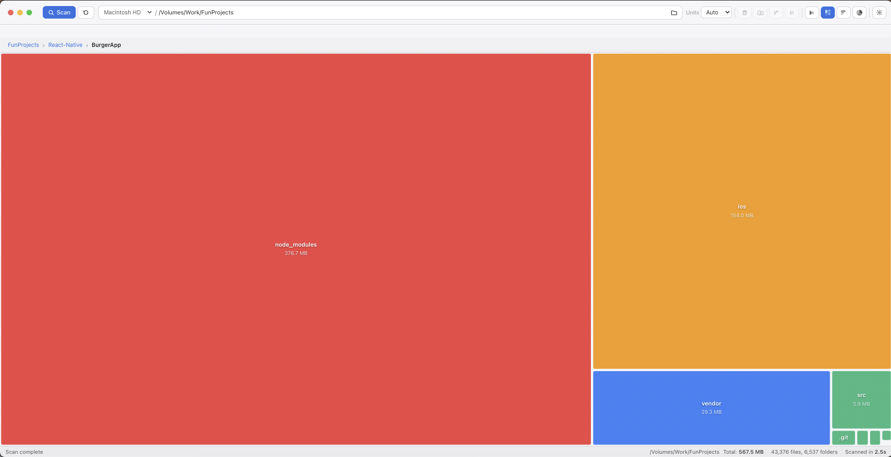

<p align="center">
  
</p>

<h1 align="center">DiskPilot</h1>

<p align="center">
  A fast, native disk space analyzer for macOS, Windows, and Linux.<br/>
  Visualize what's eating your storage — and reclaim it.
</p>

<p align="center">
  
  
  
</p>

---

## Features

- **Deep disk scan** — recursively walks any folder in seconds, counting real sizes with hardlink deduplication so numbers are accurate
- **Tree view** — sortable columns (size, allocated, files, folders, last modified) with a virtual scroller that handles millions of rows without lag
- **Treemap view** — squarified treemap for instant visual identification of space hogs; click to drill down, breadcrumb to navigate back
- **Multi-selection** — click, Shift+click, Ctrl/Cmd+click, Shift+Arrow to select multiple items; bulk delete
- **Column resizing** — drag column edges to resize; widths persist across sessions
- **Delete to Trash** — send files and folders directly to the system Trash from inside the app
- **Scan rate & elapsed time** — live scan speed (GB/s) and elapsed time shown during scanning
- **Dark / Light / Auto theme** — follows your OS preference or can be set manually
- **Keyboard-first navigation** — arrow keys, Enter, Backspace/Delete, all the expected shortcuts
- **Context menu** — Open, Show in Finder/Explorer, Copy Path, Delete
- **Cross-platform** — macOS (Intel + Apple Silicon universal), Windows x64, Linux AppImage/deb

---

## Screenshots

| | |
|---|---|
|  |  |
|  |  |
|  | |

---

## Getting Started

### Prerequisites

- [Node.js](https://nodejs.org/) 18 or later
- npm 9 or later

### Install & Run (development)

```bash
git clone https://github.com/mhkasif/DiskPilot.git
cd DiskPilot
npm install
npm start
```

> **Note:** In development the dock/taskbar shows "Electron" because the app runs inside the Electron binary. Build the app (see below) to see "DiskPilot" everywhere.

---

## Building

Install dependencies first if you haven't already:

```bash
npm install
```

| Command | Output |
|---|---|
| `npm run build:mac` | Universal `.dmg` for macOS |
| `npm run build:win` | NSIS installer for Windows x64 |
| `npm run build:linux` | AppImage + `.deb` for Linux |
| `npm run build` | Build for the current platform |

Distributable files are written to the `dist/` folder.

---

## Project Structure

```
diskpilot/
├── assets/                    # App icons
├── src/
│   ├── main/                  # Electron main process
│   │   ├── index.js           # Window creation, app lifecycle
│   │   ├── menu.js            # Native application menu
│   │   └── ipc/
│   │       ├── filesystem.js  # Drive list, home dir, directory picker
│   │       ├── scanner.js     # Recursive scan with hardlink dedup
│   │       └── fileops.js     # Delete, open, show in Finder/Explorer
│   ├── preload/
│   │   └── index.js           # contextBridge API surface
│   └── renderer/
│       ├── index.html
│       ├── css/               # Per-concern stylesheets (no bundler)
│       └── js/                # ES modules (no bundler)
│           ├── app.js         # Entry point
│           ├── tree.js        # Virtual-scrolled tree view
│           ├── treemap.js     # Squarify treemap
│           ├── scan.js        # Scan orchestration & state
│           └── ...
└── package.json
```

---

## Keyboard Shortcuts

| Key | Action |
|---|---|
| `↑` / `↓` | Navigate rows |
| `Shift+↑` / `Shift+↓` | Extend selection |
| `→` | Expand folder / enter first child |
| `←` | Collapse folder / jump to parent |
| `Enter` | Expand folder or open file |
| `Backspace` / `Delete` | Delete selected item(s) |
| `Cmd/Ctrl + Click` | Toggle item in selection |
| `Shift + Click` | Range select |
| `Escape` | Close context menu |
| `Cmd+O` (macOS) / `Ctrl+O` (Win/Linux) | Scan directory |
| `F5` | Refresh current scan |

---

## Contributing

Contributions are welcome! Please open an issue to discuss what you'd like to change before submitting a pull request.

1. Fork the repository
2. Create a feature branch: `git checkout -b feature/my-feature`
3. Commit your changes: `git commit -m 'Add my feature'`
4. Push to the branch: `git push origin feature/my-feature`
5. Open a Pull Request

---

## License

MIT — see [LICENSE](LICENSE) for details.
