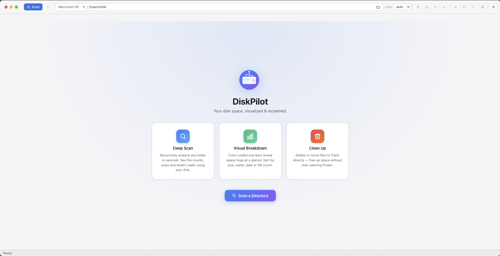
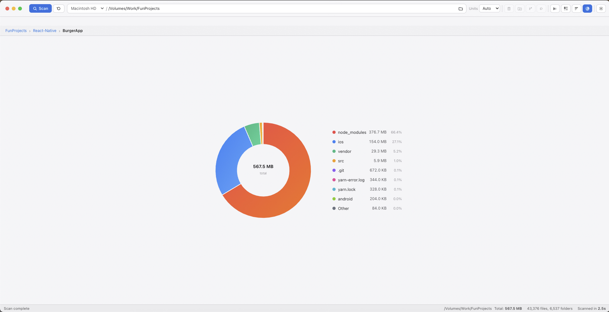
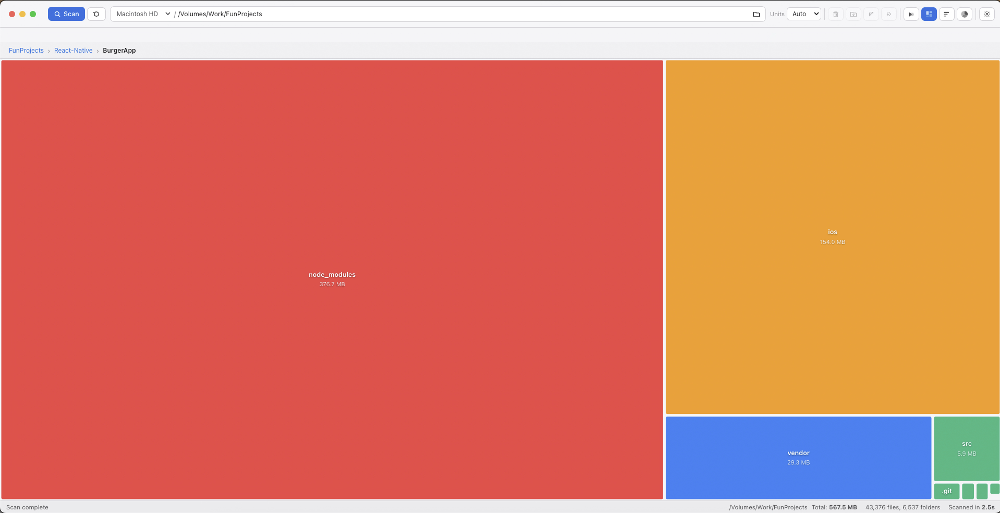
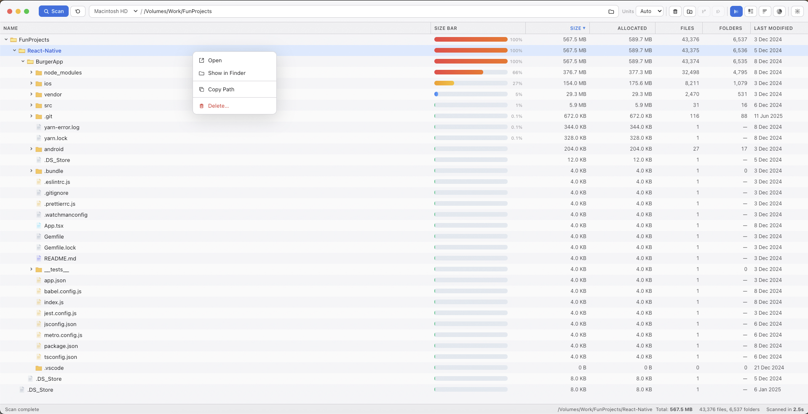

<p align="center">
  
</p>

<h1 align="center">DiskPilot</h1>

<p align="center">
  <b>Free Cross-Platform Disk Space Analyzer</b><br/>
  macOS • Windows • Linux<br/><br/>
  Visualize what’s eating your storage — and reclaim it.
</p>

<p align="center">
  Built by <b>Haseeb (MHKASIF)</b>
</p>

<p align="center">
  <a href="https://mhkasif.github.io/DiskPilot/">🌐 Official Website</a> •
  <a href="https://github.com/mhkasif/DiskPilot/releases">⬇ Download</a>
</p>

<p align="center">
  
  
  
</p>

---

## What is DiskPilot?

DiskPilot is a fast, native-feeling disk space analyzer for:

- macOS (Intel + Apple Silicon)
- Windows x64
- Linux (AppImage + .deb)

It scans any directory, calculates real file sizes (with hardlink
deduplication), and visualizes storage usage through a powerful tree view and
treemap.

No cloud. No tracking. No subscriptions. Just a fast, free storage analysis
tool.

---

## Why DiskPilot?

Most operating systems show abstract storage bars — but don’t tell you exactly
_where_ your space is going.

DiskPilot gives you:

- Precise folder-level disk usage
- Visual treemap for instant space hog detection
- Accurate size calculation (no double-counting hardlinks)
- High performance even with millions of files
- Native experience across Windows, macOS, and Linux

---

## Features – What Makes DiskPilot Powerful

- Deep disk scan — recursively walks any folder in seconds
- Hardlink deduplication — accurate real disk usage calculation
- Tree view — sortable columns: Size, Allocated, Files, Folders, Last Modified
- Virtual scrolling — handles millions of rows without lag
- Treemap view — squarified treemap layout
  - Click to drill down
  - Breadcrumb navigation
- Multi-selection: Click, Shift+Click, Ctrl/Cmd+Click, Shift+Arrow
- Bulk delete
- Delete to Trash — safe removal via system Trash
- Column resizing — widths persist across sessions
- Live scan rate (GB/s) + elapsed time
- Dark / Light / Auto theme
- Keyboard-first navigation
- Native context menu: Open, Show in Finder/Explorer, Copy Path, Delete
- Cross-platform builds: macOS Universal (.dmg), Windows NSIS installer, Linux
  AppImage + .deb

---

## Screenshots

|                                     |                                     |
| ----------------------------------- | ----------------------------------- |
|  |  |
|  |  |

---

## Download

Prebuilt binaries are available in the Releases section:

https://github.com/mhkasif/DiskPilot/releases

Available formats:

- macOS Universal `.dmg`
- Windows x64 `.exe`
- Linux AppImage
- Linux `.deb`

### Install

**macOS**

1. Download the `.dmg` file from Releases
2. Open the `.dmg` and drag **DiskPilot** to your **Applications** folder
3. **First launch:** Since the app is not notarized, macOS will warn you. To
   open it:
   - **Right-click** (or Control+click) on DiskPilot in Applications
   - Click **"Open"** from the menu
   - Click **"Open"** again in the dialog
   - After this one-time step, it opens normally every time
4. If you still see _"is damaged"_, run this in Terminal:
   ```bash
   xattr -cr /Applications/DiskPilot.app
   ```

**Windows**

1. Download the `.exe` installer from Releases
2. Run the installer — DiskPilot will install and launch automatically

**Linux**

- **AppImage:** Download, then run:
  ```bash
  chmod +x DiskPilot-*.AppImage && ./DiskPilot-*.AppImage
  ```
- **Debian/Ubuntu:** Download the `.deb`, then:
  ```bash
  sudo dpkg -i diskpilot_*.deb
  ```

---

## Getting Started (Development)

### Prerequisites

- Node.js 18+
- npm 9+

### Clone & Run

Clone the repository, install dependencies, and run the app:

`git clone https://github.com/mhkasif/DiskPilot.git` `cd DiskPilot`
`npm install` `npm start`

> Note: In development mode, the dock/taskbar shows "Electron" because the app
> runs inside the Electron binary. Build the app to see "DiskPilot" everywhere.

---

### Building

Install dependencies first:

`npm install`

| Command               | Output                     |
| --------------------- | -------------------------- |
| `npm run build:mac`   | Universal `.dmg` for macOS |
| `npm run build:win`   | NSIS installer for Windows |
| `npm run build:linux` | AppImage + `.deb`          |
| `npm run build`       | Build for current platform |

Distributables are written to the `dist/` folder.

---

### Project Structure

```
diskpilot/
├── assets/
├── src/
│   ├── main/
│   │   ├── index.js
│   │   ├── menu.js
│   │   └── ipc/
│   │       ├── filesystem.js
│   │       ├── scanner.js
│   │       └── fileops.js
│   ├── preload/
│   │   └── index.js
│   └── renderer/
│       ├── index.html
│       ├── css/
│       └── js/
│           ├── app.js
│           ├── tree.js
│           ├── treemap.js
│           ├── scan.js
│           └── ...
└── package.json
```

---

### Keyboard Shortcuts

| Key                                | Action                            |
| ---------------------------------- | --------------------------------- |
| ↑ / ↓                              | Navigate rows                     |
| Shift+↑ / Shift+↓                  | Extend selection                  |
| →                                  | Expand folder / enter first child |
| ←                                  | Collapse folder / go to parent    |
| Enter                              | Expand folder or open file        |
| Backspace / Delete                 | Delete selected item(s)           |
| Cmd/Ctrl + Click                   | Toggle selection                  |
| Shift + Click                      | Range select                      |
| Escape                             | Close context menu                |
| Cmd+O (macOS) / Ctrl+O (Win/Linux) | Scan directory                    |
| F5                                 | Refresh current scan              |

---

### Contributing

Contributions are welcome:

1. Fork the repository
2. Create a branch: `git checkout -b feature/my-feature`
3. Commit changes: `git commit -m "Add my feature"`
4. Push branch: `git push origin feature/my-feature`
5. Open a Pull Request

Please open an issue first for significant changes.

---

### Roadmap

- File type filtering
- Search within scan results
- Export scan reports (CSV / JSON)
- Performance improvements for network drives

---

### License

MIT — see LICENSE file for details.

---

### About the Author

DiskPilot is built and maintained by **Haseeb (MHKASIF)** Full Stack Engineer &
Product Builder

Portfolio: https://mhkasif.github.io LinkedIn:
https://www.linkedin.com/in/mhkasif97/

If you find DiskPilot useful, consider starring the repository ⭐
